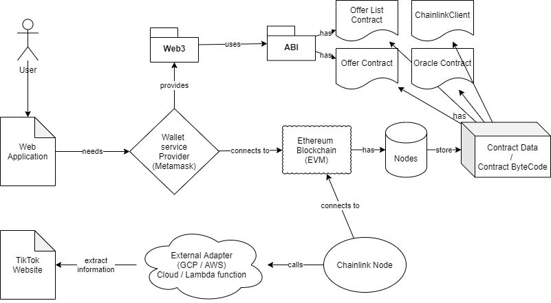

# SponsorProject
## Prototype
https://www.figma.com/proto/77PZwdDCkrlPNn5Q6nlPsj/TFG?node-id=1%3A2&scaling=min-zoom

## App
https://xavisanta.github.io/SponsorProject/

## Architecture

## Sequence diagrams
### Create Offer

### Apply to Offer

## Class diagram

# Screenshots App
### Initial page with list of offers created

### Process of creating an offer

To make the contract work, we need to send LINK tokens to it which will be used as a payment to the Chainlink oracle. 
The oracle uses LINK to:
* Check the music Id of the video on applying to the offer.
* Check the likes of the video after N days

### Applying to offer

### Claiming the prize

# Chainlink
## Tasks

## Chainlink node GUI

# Scrapper TikTok
## Metadata returned from a single video

